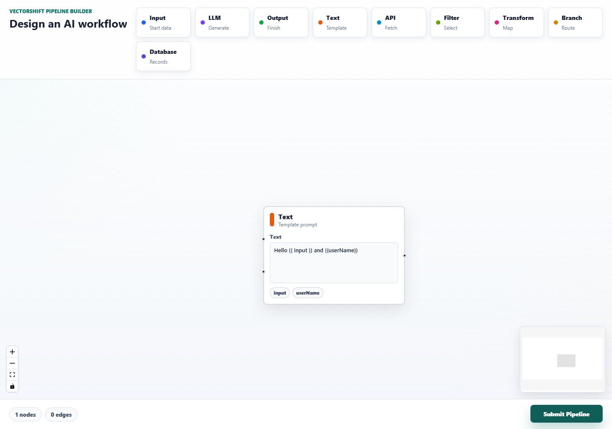
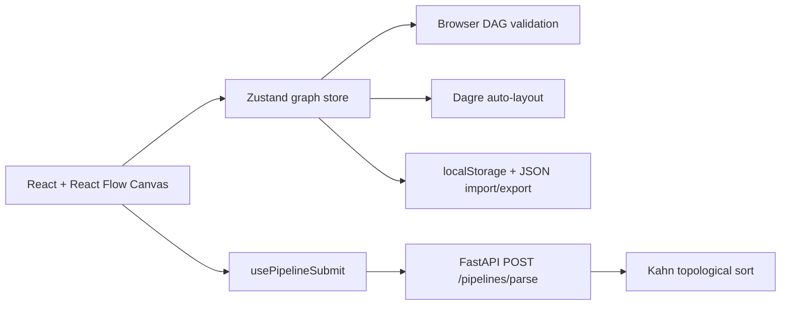

# AI Pipeline Builder

A production-grade visual AI workflow editor built for the VectorShift assessment. It is a mini Zapier x LangFlow experience with a typed React Flow canvas, config-driven nodes, live DAG validation, local persistence, command palette, mock execution preview, and a FastAPI parser endpoint.



## Tech Stack

- Frontend: Vite, React, TypeScript, Tailwind, shadcn-style UI primitives, React Flow, Zustand, cmdk, dagre, Framer Motion, sonner.
- Backend: FastAPI, Pydantic, CORS, Kahn topological sort.

## Setup

```bash
cd frontend
npm install
npm run dev
```

The frontend runs on `http://127.0.0.1:5173`.

```bash
cd backend
python -m venv .venv
.venv\Scripts\python -m pip install -r requirements.txt
.venv\Scripts\python -m uvicorn main:app --reload
```

The backend runs on `http://127.0.0.1:8000`. The frontend reads `VITE_API_BASE_URL` from `frontend/.env`.

## Architecture



## Design Decisions

The node system is powered by a single `BaseNode` in `frontend/src/components/nodes/BaseNode.tsx`. Each node is defined as one `NodeConfig` in `frontend/src/components/nodes/nodeConfigs.ts`: title, icon, category, inputs, outputs, fields, and accent metadata. Standard nodes are produced by `createConfiguredNode`, while the Text node reuses the same base shell and swaps in the dynamic variable editor.

DAG validation uses Kahn's algorithm on the backend because it is linear in nodes plus edges and gives a clear pass/fail answer for pipeline submission. The frontend also runs cycle detection on every edge change so invalid edges pulse red before submit.

Styling uses zinc neutrals, 1px borders, rounded-xl surfaces, subtle shadows, and a single teal accent. Node category color appears only in handle/header dots: input blue, LLM purple, output green, logic amber, data pink.

## Feature Checklist

- 10 config-driven nodes: Input, Output, LLM, Text, Custom, API, Filter, Transform, Branch, Database.
- Text node auto-sizes from 200x80 to 500x400, parses `{{variableName}}`, creates dynamic left handles, highlights variables, and reports invalid identifiers inline.
- React Flow canvas with dashed animated edges, dotted background, minimap, controls, selection rings, hover states, empty state, and responsive layout.
- Submit Pipeline posts `{ nodes, edges }` to FastAPI and shows node count, edge count, and DAG status in an AlertDialog with toast feedback.
- Command palette, undo/redo, node config panel, save/load, JSON import/export, live validation, auto-layout, typed connections, mock run preview, keyboard cheatsheet, favicon, meta tags, and 404 state.

## Verification

```bash
cd frontend
npm run build
```

Build passed with strict TypeScript and Vite production output.

```bash
cd backend
@'
from fastapi.testclient import TestClient
from main import app
client = TestClient(app)
print(client.post("/pipelines/parse", json={
    "nodes": [{"id": "a"}, {"id": "b"}],
    "edges": [{"source": "a", "target": "b"}],
}).json())
print(client.post("/pipelines/parse", json={
    "nodes": [{"id": "a"}, {"id": "b"}],
    "edges": [{"source": "a", "target": "b"}, {"source": "b", "target": "a"}],
}).json())
'@ | .venv\Scripts\python.exe -
```

Expected output:

```text
{'num_nodes': 2, 'num_edges': 1, 'is_dag': True}
{'num_nodes': 2, 'num_edges': 2, 'is_dag': False}
```

## Commit Style

Use conventional commits, for example:

```text
feat: add config-driven pipeline nodes
feat: integrate FastAPI DAG parser
chore: document setup and architecture
```
